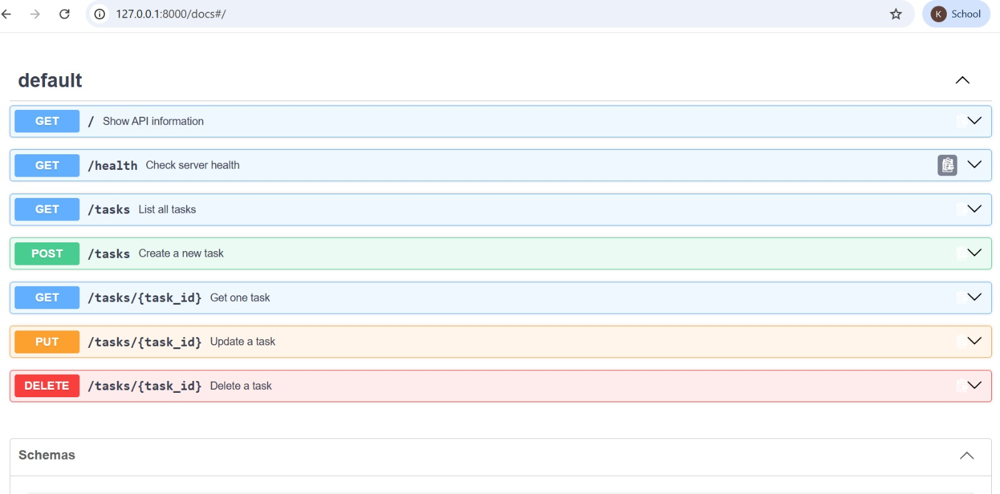

# Task API — FastAPI CRUD Assignment

A small in-memory REST API for managing a to-do list. It supports the four CRUD operations: Create, Read, Update and Delete.

## Features

- `GET /` — API information
- `GET /health` — health check
- `GET /tasks` — list all tasks
- `GET /tasks/{id}` — get one task
- `POST /tasks` — create a task
- `PUT /tasks/{id}` — update a task
- `DELETE /tasks/{id}` — delete a task
- Correct HTTP status codes: `200`, `201`, `204`, `400`, `404`
- In-memory storage only
- Swagger UI at `/docs`

## Requirements

- Python 3.10+
- FastAPI
- Uvicorn

## Installation and Run

### 1. Create a virtual environment

Windows:

```bash
python -m venv venv
venv\Scripts\activate
```

macOS/Linux:

```bash
python3 -m venv venv
source venv/bin/activate
```

### 2. Install dependencies

```bash
pip install -r requirements.txt
```

### 3. Start the server

```bash
uvicorn main:app --reload
```

Server:

```text
http://localhost:8000
```

Swagger UI:

```text
http://localhost:8000/docs
```

## Endpoint Table

| Method | Endpoint | Purpose | Success |
|---|---|---|---|
| GET | `/` | API information | 200 |
| GET | `/health` | Health check | 200 |
| GET | `/tasks` | List all tasks | 200 |
| GET | `/tasks/{id}` | Get one task | 200 |
| POST | `/tasks` | Create a task | 201 |
| PUT | `/tasks/{id}` | Update a task | 200 |
| DELETE | `/tasks/{id}` | Delete a task | 204 |

## Example Task

```json
{
  "id": 1,
  "title": "Learn FastAPI",
  "done": false
}
```

## Testing with curl

### Root endpoint

```bash
curl -i http://localhost:8000/
```

### Health endpoint

```bash
curl -i http://localhost:8000/health
```

### List tasks

```bash
curl -i http://localhost:8000/tasks
```

### Get one task

```bash
curl -i http://localhost:8000/tasks/1
```

### Test 404

```bash
curl -i http://localhost:8000/tasks/99
```

Expected body:

```json
{"error":"Task 99 not found"}
```

### Create a task

```bash
curl -i -X POST http://localhost:8000/tasks \
  -H "Content-Type: application/json" \
  -d '{"title":"Buy milk"}'
```

Expected status: `201 Created`

### Test POST validation

```bash
curl -i -X POST http://localhost:8000/tasks \
  -H "Content-Type: application/json" \
  -d '{}'
```

Expected status: `400 Bad Request`

### Update a task

```bash
curl -i -X PUT http://localhost:8000/tasks/1 \
  -H "Content-Type: application/json" \
  -d '{"title":"Learn FastAPI well","done":true}'
```

Expected status: `200 OK`

### Delete a task

```bash
curl -i -X DELETE http://localhost:8000/tasks/1
```

Expected status: `204 No Content`

## Swagger UI Test

Open:

```text
http://localhost:8000/docs
```

Use **Try it out** to:

1. Create a task.
2. List all tasks.
3. Update the new task.
4. Delete the task.
5. Confirm the final list.

## Example curl Output

After the server is running, replace this section with an actual `curl -i` output from your own machine. Example:

```text
HTTP/1.1 200 OK
content-type: application/json

{"status":"ok"}
```

## Swagger Screenshot

Add your own Swagger UI screenshot here after running the API.

Example Markdown after saving the image as `swagger.png`:

```markdown

```

## Important Note About In-Memory Storage

The tasks are stored only in the Python program's memory. If the server is restarted, any tasks created or edited while it was running are lost, and the original three example tasks return. A database would provide persistent storage and prevent this data loss.

## Suggested Git Commits

Use meaningful commits while you build/test each stage yourself:

```text
Stage 0: hello server
Stage 1: root and health endpoints
Stage 2: read endpoints with 404
Stage 3: create with validation
Stage 4: full CRUD
Stage 5: Swagger UI
Stage 6: publish and docs
```
